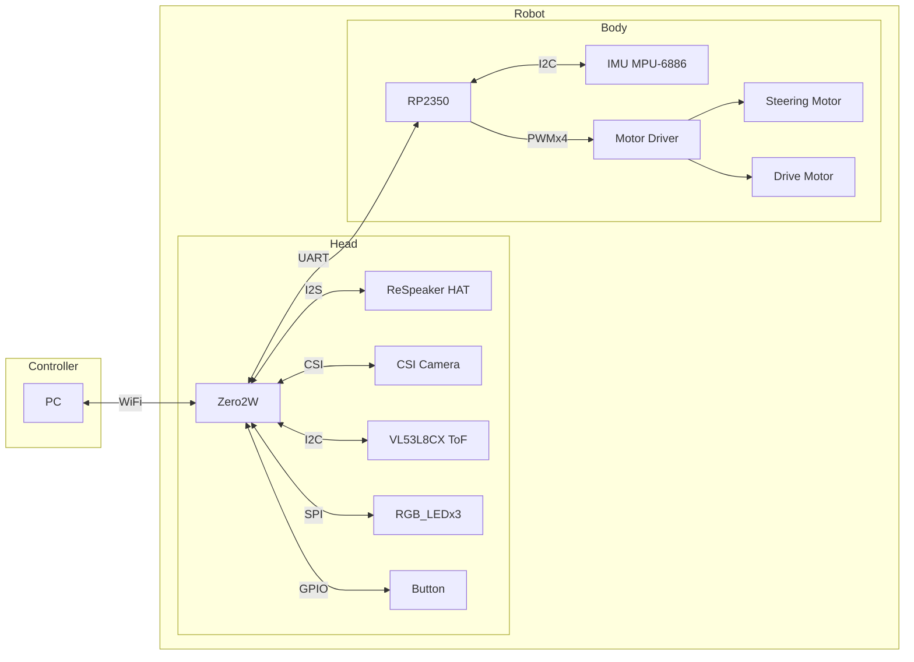

# Robot System Overview

## Controller

* Ubuntu 24.04.3 LTS

## Robot

### Housing

* [FOLO](https://www.elekit.co.jp/product/MR-9107)

### Robot Head

* [Raspberry Pi Zero 2 W (Ubuntu 24.04.3 LTS)](https://www.raspberrypi.com/products/raspberry-pi-zero-2-w/)
* [ReSpeaker 2-Mics Pi HAT](https://wiki.seeedstudio.com/ReSpeaker_2_Mics_Pi_HAT/)
* CSI-Camera
* VL53L8CX

### Robot Body

* [Seeed Studio XIAO RP2350](https://www.seeedstudio.com/Seeed-XIAO-RP2350-p-5944.html)
* [Motor Driver](https://www.cytron.io/p-maker-drive-simplifying-h-bridge-motor-driver-for-beginner)
* [IMU](https://m5stack.oss-cn-shenzhen.aliyuncs.com/resource/docs/datasheet/core/MPU-6886-000193%2Bv1.1_GHIC_en.pdf)

# Hardware & Connectivity Diagram

# Pin Assignment 

| Device | Signal    | Pin    | connect        |
|:------:|:---------:|:------:|:--------------:|
| Zero2W | 5V        | -      | RP2350 5V      |
| Zero2W | GND       | -      | RP2350 GND     |
| Zero2W | UART0 TXD | 14     | RP2350 RX      |
| Zero2W | UART0 RXD | 15     | RP2350 TX      |
| Zero2W | CSI       | -      | Camera         |
| Zero2W | I2C SDA1  | 2      | VL53L8CX(ToF)  |
| Zero2W | I2C SCL1  | 3      | VL53L8CX(ToF)  |
| Zero2W | GPIO17    | 17     | Button         |
| Zero2W | SPI MOSI  | 10     | RGB LEDx3      |
| Zero2W | SPI SCLK  | 11     | RGB LEDx3      |
| Zero2W | I2S_CLK   | 18     | WM8960         |
| Zero2W | I2S_LRCLK | 19     | WM8960         |
| Zero2W | I2S_ADC   | 20     | WM8960         |
| Zero2W | I2S_DAC   | 21     | WM8960         |
| Zero2W | GPIO12    | 12     | Reserve        |
| Zero2W | GPIO13    | 13     | Reserve        |
| Zero2W | GPIO16    | 16     | RP2350 RESET   |
| Zero2W | SWCLK     | 6      | RP2350 CLK     |
| Zero2W | SWDIO     | 5      | RP2350 DIO     |
| Zero2W | PWM       | 12      | Eye           |
| Zero2W | PWM       | 13      | Eye           |
| RP2350 | UART0 TXD | GPIO0  | Zero2W RXD     |
| RP2350 | UART0 RXD | GPIO1  | Zero2W TXD     | 
| RP2350 | I2C0 SDA  | GPIO19 | MPU-6886 (IMU) |
| RP2350 | I2C0 SCL  | GPIO18 | MPU-6886 (IMU) |
| RP2350 | PWM_6A    | GPIO8  | MotorDrv M1A   |
| RP2350 | PWM_6B    | GPIO9  | MotorDrv M1B   |
| RP2350 | PWM_4B    | GPIO12 | MotorDrv M2B   |
| RP2350 | PWM_4A    | GPIO13 | MotorDrv M2A   |

