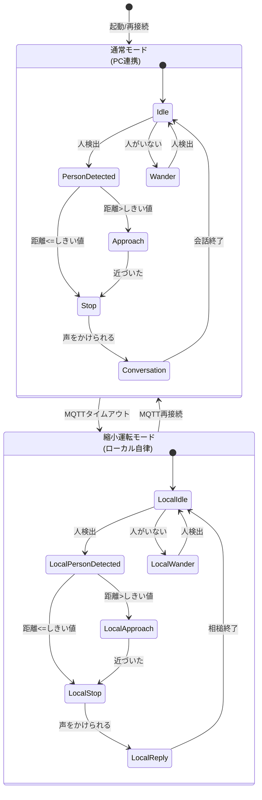

# RobotC 状態遷移図・運転モード設計

## 概要

本ドキュメントは、RobotCの「通常モード（PC連携）」と「縮小運転モード（PC未接続）」を含む状態遷移設計をまとめたものです。

---

## 運転モードと状態遷移図

---

## 各状態の説明

### 通常モード（MQTT_Connected）
- **Idle**: 待機状態。人検出を監視
- **PersonDetected**: 人を検出した直後
- **Approach**: 距離が遠いので接近
- **Stop**: 目標距離で停止
- **Conversation**: 会話・感情表現
- **Wander**: 人がいない場合の徘徊

### 縮小運転モード（MQTT_Lost）
- **LocalIdle**: 待機状態。人検出を監視
- **LocalPersonDetected**: 人を検出した直後
- **LocalApproach**: 距離が遠いので接近
- **LocalStop**: 目標距離で停止
- **LocalReply**: 声をかけられたら簡単な相槌
- **LocalWander**: 人がいない場合の徘徊

---

## モード切り替え仕様
- MQTT接続の有無を定期監視
- タイムアウト時は自動で縮小運転モードへ
- 再接続時は通常モードに復帰

---

## 今後の拡張案
- 状態ごとの詳細なサブステート設計
- エラー・異常時のフェイルセーフ遷移
- 各状態でのLED・音声・動作パターン定義
