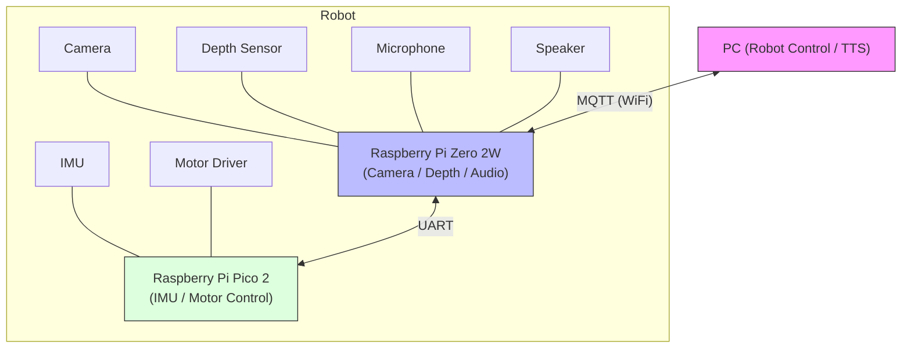

# RobotC

能動的に動くペットロボット
人を探してついてくる・障害物回避・会話・感情表現



---

## 目的

- 近くの人を探してついてくる
- 障害物を避ける
- 人と会話し、感情表現する

## 主な機能

- 人検出・追従（カメラ/距離センサ/マイク）
- 障害物回避（簡易SLAM/マッピング）
- 6足歩行（IMU＋2モーター制御）
- 会話（マイク/スピーカー）
- 感情表現（LED）

## シナリオ例

1. 回転制御で人を探索
2. 人を見つけたら距離測定
3. 距離に応じて接近・停止・後退
4. 障害物があれば回避
5. 一定距離以内で会話・感情表現
6. 人がいなければ徘徊

## システム構成

- **PC**  
    - 重い処理（音声認識/合成・地図生成など）
    - Zero2WとMQTT通信

- **Raspberry Pi Zero 2W**  
    - カメラ・距離センサ・マイク・スピーカー
    - Pico 2とUART通信

- **Raspberry Pi Pico 2**  
    - IMU・モータードライバ

---

## セットアップ

### 1. Raspberry Pi Zero 2W

```bash
sudo apt update
sudo apt install -y libopencv-dev libarmadillo-dev liblapack-dev libblas-dev libi2c-dev python3-serial python3-flask python3-numpy
```

### 2. PCクロスコンパイル環境

# ...（既存手順を省略せず記載）

### 3. デプロイ・キャリブレーション

- `scripts/deploy_head.sh` / `deploy_body.sh` で自動デプロイ
- IMUキャリブレーションWebツールあり

---

## ディレクトリ構成

```
RobotC/
├── RobotHead/           # Camera + Depth + Object Detection
│   ├── src/
│   │   ├── sensors/     # VL53L8CX ToF sensor
│   │   ├── detection/   # Object detection (YOLO)
│   │   └── platform/    # I2C, hardware abstraction
│   └── include/
├── RobotBody/           # IMU + Motor control (Pico 2)
├── Tool/                # Calibration tools
├── Data/
│   └── models/          # YOLO models (not in git)
├── scripts/             # Build & deployment scripts
└── libs/                # Cross-compile libraries (not in git)
```

## ライセンス

MIT

### 3. Download Object Detection Model

```bash
cd Data/models
wget https://github.com/AlexeyAB/darknet/releases/download/darknet_yolo_v4_pre/yolov4-tiny.weights
wget https://raw.githubusercontent.com/AlexeyAB/darknet/master/cfg/yolov4-tiny.cfg
wget https://raw.githubusercontent.com/AlexeyAB/darknet/master/data/coco.names
```

### 4. Build

```bash
cd RobotHead/build
cmake ..
make
```

### 5. Deploy Configuration

Copy `scripts/.env.example` to `scripts/.env` and edit:

```bash
cd scripts
cp .env.example .env
# Edit .env with your Raspberry Pi IP and username
```

### 6. Deploy & Run

```bash
cd scripts
bash deploy_head.sh

# On Raspberry Pi
cd ~/robot_head
sudo ./robot_head --stream
```

Access web stream at `http://<raspberry-pi-ip>:8080/`

## Calibration

### Camera Calibration (Optional)

```bash
# On Raspberry Pi
cd ~/robot_tools
./camera_calibration_web
# Open browser: http://<raspberry-pi-ip>:8080/
```

### Depth Overlay Calibration

```bash
# On Raspberry Pi
cd ~/robot_tools
sudo ./depth_calibration_web
# Open browser: http://<raspberry-pi-ip>:8081/
```

## Project Structure

```
RobotC/
├── RobotHead/           # Camera + Depth + Object Detection
│   ├── src/
│   │   ├── sensors/     # VL53L8CX ToF sensor
│   │   ├── detection/   # Object detection (YOLO)
│   │   └── platform/    # I2C, hardware abstraction
│   └── include/
├── Tool/                # Calibration tools
├── Data/
│   └── models/          # YOLO models (not in git)
├── scripts/             # Build & deployment scripts
└── libs/                # Cross-compile libraries (not in git)
```

## License

MIT
