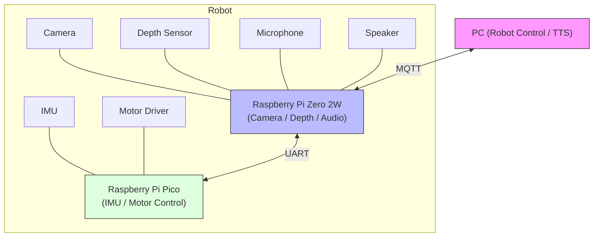

# RobotC
my robot project



## Features

- **Camera & Depth Sensing**: OV5647 Camera + VL53L8CX ToF Sensor (8x8 depth matrix)
- **Object Detection**: YOLOv4-tiny with OpenCV DNN
- **Web Streaming**: Real-time video streaming with depth overlay (HTTP MJPEG)
- **Cross-compilation**: Build on PC, deploy to Raspberry Pi Zero 2W

## Hardware

- Raspberry Pi Zero 2W (512MB RAM)
- OV5647 Camera Module
- VL53L8CX ToF Sensor (I2C)
- Raspberry Pi Pico (for motor control)

## Setup

### 1. Raspberry Pi Setup

On Raspberry Pi, install required packages:

```bash
sudo apt update
sudo apt install -y \
    libopencv-dev \
    libarmadillo-dev \
    liblapack-dev \
    libblas-dev \
    libi2c-dev
```

### 2. PC Cross-Compilation Setup

Clone dependencies from Raspberry Pi:

```bash
# On Raspberry Pi
cd /usr/lib/aarch64-linux-gnu
tar czf ~/raspi_libs.tar.gz *.so* lapack/ blas/

# On PC
scp pi@raspberrypi:~/raspi_libs.tar.gz .
mkdir -p libs/aarch64
cd libs/aarch64
tar xzf ../../raspi_libs.tar.gz
```

Install cross-compiler on PC:

```bash
sudo apt install -y g++-aarch64-linux-gnu gcc-aarch64-linux-gnu
```

### 3. Download Object Detection Model

```bash
cd Data/models
wget https://github.com/AlexeyAB/darknet/releases/download/darknet_yolo_v4_pre/yolov4-tiny.weights
wget https://raw.githubusercontent.com/AlexeyAB/darknet/master/cfg/yolov4-tiny.cfg
wget https://raw.githubusercontent.com/AlexeyAB/darknet/master/data/coco.names
```

### 4. Build

```bash
cd RobotHead/build
cmake ..
make
```

### 5. Deploy Configuration

Copy `scripts/.env.example` to `scripts/.env` and edit:

```bash
cd scripts
cp .env.example .env
# Edit .env with your Raspberry Pi IP and username
```

### 6. Deploy & Run

```bash
cd scripts
bash deploy_head.sh

# On Raspberry Pi
cd ~/robot_head
sudo ./robot_head --stream
```

Access web stream at `http://<raspberry-pi-ip>:8080/`

## Calibration

### Camera Calibration (Optional)

```bash
# On Raspberry Pi
cd ~/robot_tools
./camera_calibration_web
# Open browser: http://<raspberry-pi-ip>:8080/
```

### Depth Overlay Calibration

```bash
# On Raspberry Pi
cd ~/robot_tools
sudo ./depth_calibration_web
# Open browser: http://<raspberry-pi-ip>:8081/
```

## Project Structure

```
RobotC/
├── RobotHead/           # Camera + Depth + Object Detection
│   ├── src/
│   │   ├── sensors/     # VL53L8CX ToF sensor
│   │   ├── detection/   # Object detection (YOLO)
│   │   └── platform/    # I2C, hardware abstraction
│   └── include/
├── Tool/                # Calibration tools
├── Data/
│   └── models/          # YOLO models (not in git)
├── scripts/             # Build & deployment scripts
└── libs/                # Cross-compile libraries (not in git)
```

## License

MIT
